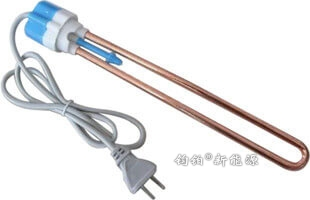
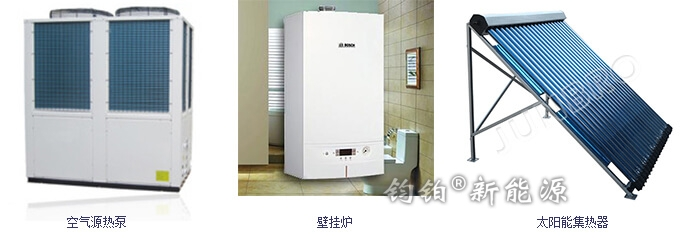

# 1.1 什么是热源？

### 一、热源定义

**热源**是指产生热水（把冷水加热）的设备，这些设备可以是由电能、天然气、太阳能等能源驱动的。

最常见的热源是电热设备，如以前家用的“热得快”，可以直接插入热水瓶烧开水，还有电水壶、电热水器和电锅炉等等，它们有一个共同的特点，都是以电能驱动的。

### 二、热源的分类

暖通系统和热水系统中常见热源，根据驱动的能源可划分为：

* 电能：电锅炉、空气能（空气能热水器和空气源热泵）、中央空调和电热水器等
* 燃气：燃气锅炉（也称燃气壁挂炉）和燃气热水器等
* 太阳能：热管式太阳能集热器、平板式集热器、工程联箱（非承压式）和普通太阳能热水器等

### 三、哪些热源可以与承压保温水箱配套？

配套承压保温水箱实现生活热水供应和供暖的，通常会选取以下热源（选取一种或同时使用多种）：

> 电锅炉、空气源热泵、中央空调、燃气锅炉和太阳能集热器

一般情况下电热水器、燃气热水器和普通太阳能热水器等无法直接与承压保温水箱连接，要通过特殊改造才能实现增大水容量的需求。

### 四、热源的选择

热源的选择没有统一的标准和建议，每一种热源都有其优点和局限。从另一个角度说，没有大量可供选择的产品，就不会有市场的百花齐放。

所以，需要根据自身的实际情况（热水需求量大小、放置空间大小、节能效果和经济实用等）来选择，在选定热源后，才能选择配套的水箱类型和型号。

更多关于热源与水箱类型的配套和选择，请参考 [3.水箱的分类与安装](../3.-shui-xiang-de-fen-lei-yu-an-zhuang/)

> 在空调系统中，如中央空调和空气源热泵的热源也具有制冷功能，所以其可称之为冷/热源。在冬天供暖时，其为**热源**，在夏天制冷时，其为**冷源**。

