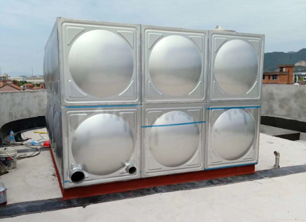
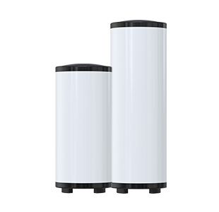

# 1.2 什么是承压保温水箱？

### 一、水箱的分类及定义

* 保温水箱
  * 承压保温水箱
    * 不锈钢保温水箱
    * 搪瓷保温水箱
  * 非承压保温水箱
* 普通储水箱（非保温）

#### A. 普通储水箱（非保温）

以上为水箱的简单分类，普通的储水箱没有保温层，其作用仅仅是储水，如消防水箱和水塔等。

#### B. 保温水箱简述

保温水箱则是由**内胆**、**保温层**和**外壳**三个主要部分构成。保温水箱又由于内胆厚度、焊接制造工艺和水箱使用不同，又可分为非承压和承压水箱。

#### C. 承压水箱和非承压水箱的区别

通常情况下，承压水箱的内胆厚度在1.0mm以上，常规选用是1.2mm、1.5mm、2.0mm及以上。非承压水箱的内胆厚度为0.3mm、0.4mm、0.5mm等。

系统安装中，承压水箱是**封闭式**，即水箱内的介质（水）不与大气连通，介质的循环需要**循环泵**进行强制循环，热水出水是有压力的。非承压水箱又叫**开式水箱**，即水箱内的介质（水）与大气连通，热水是靠水的自重出水（如普通太阳能热水器供应热水）。

#### D. 承压保温水箱的内胆

承压保温水箱按照**内胆的材质**又可划分为不锈钢承压保温水箱和搪瓷保温水箱。前者内胆一般采用不锈钢304/316材质，后者使用搪瓷内胆。

> 外壳材质可选：不锈钢201、304，氟碳板和镀锌板等，不锈钢承压保温水箱和搪瓷保温水箱的区分不以外壳来定义。

#### E. 不锈钢水箱和搪瓷水箱的简单对比

| 产品 | 不锈钢承压保温水箱 | 搪瓷承压保温水箱 |
| :---: | :---: | :---: |
| 保温效果 | 良好 | 良好 |
| 适用水质 | 水质要求高 | 水质要求低 |
| 使用寿命 | 15-20年 | 10-15年 |
| 产品可选 | 30L-10T | 60L-200L |
| 是否定制 | 可定制 | 不可定制 |

### 二、承压保温水箱的作用

承压保温水箱顾名思义能够承受压力和保温的储热水箱，保温层起到隔绝水箱内介质与环境的热交换。保温层的保温原理和效果详见[保温层的聚氨酯发泡](../2.-shui-xiang-zhi-zao-liu-cheng/2.4-bao-wen-ceng-de-ju-an-zhi-fa-pao.md)。

* 在供暖系统中，承压保温水箱能够起到保护主机、节能、高效除霜和恒定温度等作用。更多信息详见[为什么要设置缓冲水箱？](../6.-tuo-zhan-yue-du/6.3-wei-shen-me-yao-she-zhi-huan-chong-shui-xiang.md)
* 在热水系统中，承压保温水箱能够保证大容量恒温热水供应，设置回水管路后，可以实现水龙头即开即得热水。由于其承压性能，出水自带压力，提升热水洗澡的舒适性。配置吨级以上的承压保温水箱，可以满足工厂、医院和学校等集中供应热水。更多信息详见 [3.2 热水水箱](../3.-shui-xiang-de-fen-lei-yu-an-zhuang/3.2-re-shui-shui-xiang.md)

承压保温水箱自身并不能加热或制冷，是和电热水器截然不同的产品。在特别定制的情况下，可以在承压保温水箱上加装电加热，使其成为电热水设备。除此之外，水箱上的电加热仅仅起到辅助和定温的功能。

