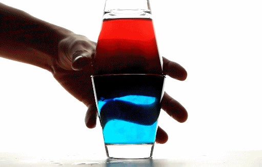

# 1.4 水箱内热水是分层的

### 一、热水比冷水密度小的原理

同样质量的水，热水中的水分子的平均动能的分子势能都比冷水大，即分子间的距离大，所以热水的体积大。因此当质量一定时，密度与体积成反比，即：密度＝质量/体积，所以热水的密度比冷水的密度小。

### 二、水箱内热水是分层的

水箱作为一个容器，在密闭情况下，相当于静止状态。由于重力的原因，密度大的冷水将下沉，密度小的热水将上浮，所以造成了水箱内的热水是分层的。所以水箱内的热水从上至下，温度是递减，一般情况下最顶部的热水温度和最底部的热水温度会有5-10℃的温差。

### 三、上进下出还是上出下进？

对水箱来说，单纯的讲 **上进下出** 还是 **上出下进** 都是不正确的，必须要明确两个前提：**水流方向**和**参照物**。

A. 由于热水在水箱内是分层的，所以当热源与水箱连接时（上进下出）：

* 热源的热水出口应当连接到水箱的上半部分接口；
* 水箱的下半部分接口应当回到热源继续加热；
* 水流方向是：热源 &gt; 水箱上 &gt; 水箱下 &gt; 回到热源

B. 当供暖终端与水箱连接时（上出下进）：

* 水箱的上半部分接口接供暖终端；
* 终端消耗热量后，热水降温并回到水箱；
* 水流方向：水箱上 &gt; 供暖终端 &gt; 终端消耗 &gt; 回到水箱下

综合以上可以看出水流的方向非常重要，一切不以参照物来讲上进下出或上出下进的说法都是不正确的。可参考 [3.1 缓冲水箱](../3.-shui-xiang-de-fen-lei-yu-an-zhuang/3.1-huan-chong-shui-xiang.md) 中的双循环安装示意图 和 [3.2 热水水箱](../3.-shui-xiang-de-fen-lei-yu-an-zhuang/3.2-re-shui-shui-xiang.md) 安装示意图。

