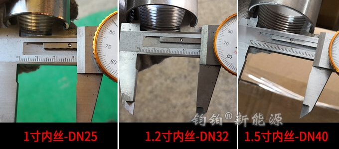

# 1.5 接口大小参照表

在 [2.1 内胆的制造](../2.-shui-xiang-zhi-zao-liu-cheng/2.1-nei-dan-de-zhi-zao.md) 中会提到，内胆上焊接的管螺纹接头是唯一与外部连接的接口。通常采用的是内丝管螺纹，常见尺寸有DN15、DN20、DN25、DN32、DN40、DN50、DN65、DN80等，更大的接口如DN80、DN100、DN150等会采用法兰接口。

PPR管道国家标准规定PPR管道外径有20、25、32、40、50、63、75、90、110、160\(单位：mm\)十种规格。

### 一、管螺纹接头和PPR管尺寸表

| 管接头公称直径 | 管接头俗称 | PPR管俗称 | PPR管外径 |
| :---: | :---: | :---: | :---: |
| DN15内丝 | 4分内丝 | 4分管 | 20mm |
| DN20内丝 | 6分内丝 | 6分管 | 25mm |
| DN25内丝 | 1寸内丝 | 1寸管 | 32mm |
| DN32内丝 | 1.2寸内丝 | 1.2寸管 | 40mm |
| DN40内丝 | 1.5寸内丝 | 1.5寸管 | 50mm |
| DN50内丝 | 2寸内丝 | 2寸管 | 63mm |
| DN65内丝 | 2.5寸内丝 | 2.5寸管 | 75mm |
| DN80内丝 | 3寸内丝 | 3寸管 | 90mm |
| DN100内丝 | 4寸内丝 | 4寸管 | 110mm |

以上列出对应的管螺纹接头和PPR管数据，在购买水箱前或主机前，需要明确接口大小，方便后续安装辅材和配件的采购。

下图为不锈钢内丝管接口内径实测图，上表中的PPR直径是指的是外径，去除管壁厚度，可以看出实际水流直径与上表大致相符。

### 二、使用补芯进行变径

水箱上的管接口尺寸与PPR管型号不匹配时，需要变径或定制水箱。譬如：

* 水箱的循环口尺寸是DN40，PPR管是DN32，则需要购买 补芯 将DN40变为DN32；
* 但如果是PPR管是DN40，水箱接口是DN32，则需要定制接口为DN40的水箱，因为仅口径变大不会增大流量，可能无法实现系统要求。

