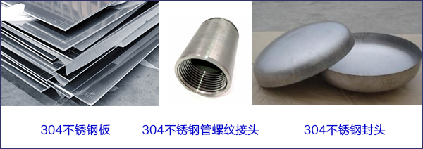
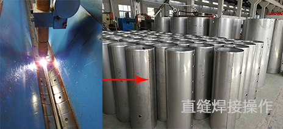
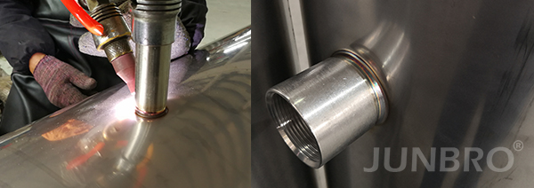
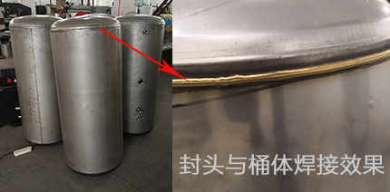
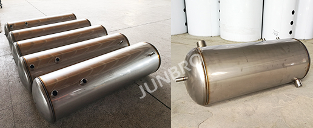

# 2.1 内胆的制造

不锈钢承压水箱内胆有三个部分构成：

* 不锈钢板（圈成圆柱体）
* 封头（上下各一个）
* 不锈钢管螺纹接头

### 一、内胆制造的一般流程

如前所述，承压保温水箱的内板厚度通常是大于1.2mm，所以需要 **滚圆机** 将其圈成圆柱体。在滚圆之前，需要在不锈钢板上冲孔（或激光割孔），用于后续焊接管接头。

接着完成焊接和压力测试：直缝焊接 → 管接头焊接 → 封头环缝焊接 → 压力测试；如果是盘管水箱，需要在封头环缝焊接前将盘管装置固定，详见[ 2.2 水箱内的盘管](2.2-shui-xiang-nei-de-pan-guan.md)。

### 二、焊接

A. 不锈钢板接缝处的焊接称之为直缝焊接，将接缝处平整对齐，焊接枪头直线走过接缝处焊接。

B. 不锈钢管螺纹接头焊接称之为环缝焊接。

C. 完成以上两项焊接后，将上下两个椭圆封头固定，通过大型环缝焊接机进行焊接。

最终的内胆成品请见下图：

### 三、决定焊接质量的因素

1. 不锈钢材质：必须保证板材、封头和接头为正宗不锈钢304/316材质；
2. 材料厚度：容积不同，板材的厚度要求不同，同时要保证封头的厚度要比板材的高一个规格。如，100L内胆采用1.2mm，则对应的封头厚度要高于1.2mm；
3. 不锈钢管螺纹接头：这是一个非常容易忽略细节，很多漏水情况的发生都集中在管接头开裂和焊接处漏水。如果在管接头这块盲目的节省成本，会给整个承压保温水箱造成很大的安全隐患。达到以下要求的管接头可以避免以上情况：
   1. 使用无缝不锈钢管，同时要避免回炉钢管；
   2. 管接头壁厚需要最少大于2.0mm；
   3. 管接头尺寸与板材上的开孔大小匹配，环缝焊接时能够确保焊接质量；
4. 焊接设备：焊接设备精密度、电流、焊丝和操作工熟练程度等也是焊接质量的重要一环；

### 四、压力测试

压力测试是内胆完成后必须完成的操作，压力测试有两种方式：

* 气压测试
* 水压测试

承压保温水箱的额定工作压力为6-7公斤（0.6-0.7MPa），但内胆压力测试时须要求在12-15公斤，试压过程中需保持10分钟压力不衰减。如发现焊接处有泄漏，找到漏水点进行补焊，补焊后再重新进行压力测试，直到完成压力测试。

> 经过严格的焊接控制，补焊率应当控制在5%以内。如果存在过多的补焊情况，内胆的质量会受到不小的影响。

### 五、注意事项

其实内胆制造时，还会涉及到很多内胆结构的技术细节，诸如如何做到排污口彻底排污、防止混水过快、盘管密封和排管设计等等。

