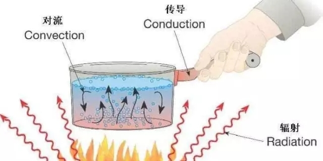
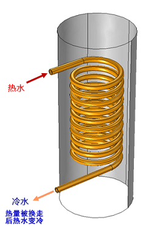
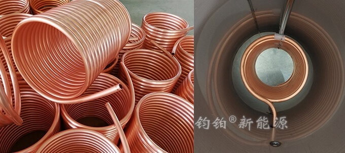

# 2.2 水箱内的盘管

### 一、热传递的三种形式

在讨论为什么要使用盘管之前，先了解一下物理学上热传递的三种形式：

### 二、为什么要使用盘管

1. 热对流：是以热水**直接**注入到水箱内，通过循环加热的方式将水箱内热水提升到设定水温。通俗点说，是把热水不停的兑到冷水中，直到冷水变热的过程。
2. 热传导（交换）：热水与冷水**不直接接触**，它们需要媒介（一般指固体）传递热量。

使用盘管即用到热交换的形式，所以我们通常称之为**盘管换热**。

盘管换热有两种换热方式（暖通和热水系统中，第1种情况比较常见）：

1. 通过盘管换热把水箱内冷水加热的过程，盘管是与**热源**连接；
2. 通过盘管换热把水箱内热量换走的过程，盘管是与**终端**连接；

由于承压水箱内部是有压力的，我们都知道在一个封闭的容器内，各个位置的压力都是相同的。在使用盘管换热时，盘管和水箱内部形成了两个系统。水箱内的压力不会传递到盘管内，同样的盘管内的压力也不会传递到水箱内部。**所以使用盘管可以做到隔绝介质和隔绝压力传递。**

### 三、盘管使用场景简述

A. 隔绝介质的场景

太阳能集热器连接承压保温水箱供应生活热水。由于太阳能集热器安装在户外，冬天有防冻的要求，除了管道保温还经常会加注防冻液，在此情况下，需要使用盘管换热的方式。

B. 隔绝压力的场景

燃气壁挂炉连接承压保温水箱供应生活热水。由于壁挂炉的压力承受范围在3公斤以内，通常设置在1.8公斤左右，而承压保温水箱内压力通常在4-6公斤才能够保证用水的舒适性，如果不使用盘管换热方式，壁挂炉将会被损坏。

C. 是否可以不使用盘管？

> 在A场景中，如果太阳能集热器不加注防冻液，也可以不使用盘管换热。
>
> 在B场景中，如果把壁挂炉和水箱的压力都设定在2公斤，也可以不使用盘管换热。

综上AB所述，如果同时使用太阳能和壁挂炉两个热源，水箱内就需要设置两组盘管。从C可知，是否使用盘管，取决于热源和具体使用要求，不过通常AB场景都建议使用盘管。详见 [3.3热水水箱（带盘管）](../3.-shui-xiang-de-fen-lei-yu-an-zhuang/3.3-re-shui-shui-xiang-dai-pan-guan.md)

### 四、盘管类别及其优缺点

盘管根据材料可以分为紫铜管和不锈钢管两种，它们的优缺点见表格：

| 材质特点 | 紫铜管 | 不锈钢管 |
| :---: | :---: | :---: |
| 导热性能 | 优 | 良 |
| 直径 | 16mm/19mm | 可定制 |
| 承压性能 | 一般 | 高 |
| 漏水情况 | 操作不当易泄露 | 采用焊接方式 |

根据以上的对比可知：

* 如果有大流量需求，一般会采用不锈钢盘管；
* 如果对换热效率要求高，可采用紫铜盘管；
* 增大不锈钢盘管的换热面积可以提升其换热功率；

根据流量和换热功率要求，需要采用不同盘管直径和长度，但由于水箱内部空间有限，并不能超限加大内部盘管直径和长度。

在内胆端盖焊接前，需要将盘管装置在内胆内，并做好固定。同时，盘管的两端穿过管接头，做好喇叭口压紧密封（不锈钢盘管则是通过焊接密封），同时必须做盘管泄漏测试。

