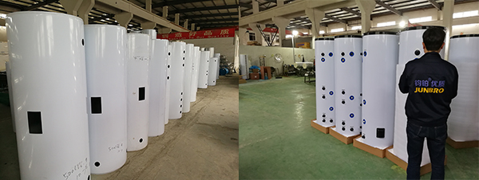

# 2.3 外壳的制造

### 一、外壳的材质有哪些

从材料成本和实用性出发，通常外壳材质选用镀锌板（彩白板），其颜色常见有白色、灰色和米色等。还有不锈钢外壳，材质有201和304可选，304比201的成本会高出很多，选购时需要避免混淆。

另外一种氟碳板介于镀锌板与不锈钢304之间，综合成本和性能考虑，这种材质是一个不错的选择。

### 二、外壳的制造流程

外壳的制造相对来说比较简单，其基本流程是：下料 → 冲孔 → 折边咬合 → 收口

下料：根据水箱的容积计算，得出外壳主体的板材尺寸，使用剪板机剪切下来。

冲孔：使用数控冲孔设备进行冲孔，用于管接头穿过；或使用激光切割机进行割孔，效率和精度会更高。

折边咬合：外壳的圆柱成型与内胆直缝焊接不同，是通过两条折边，然后咬合在一起，再通过压机压过咬边完成。由于外壳材质和厚度的原因，也不需要像内胆制造时通过圈圆设备完成圆柱成型。

收口：外壳圆柱成型后，需要预先将两端收口（缩口），便于发泡组装时安装外端盖。

