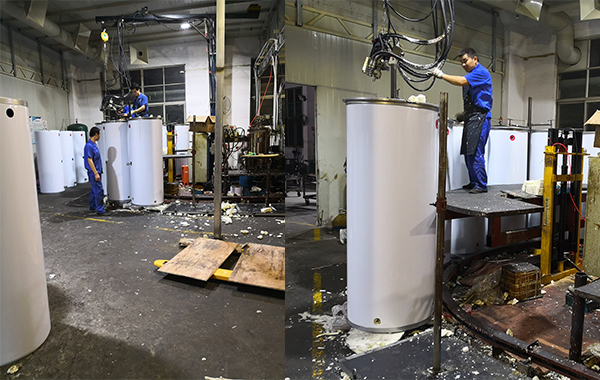
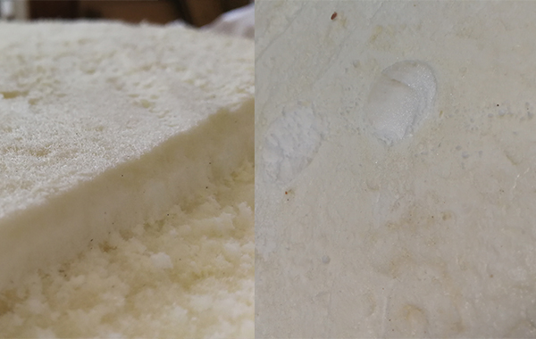

# 2.4 保温层的聚氨酯发泡

### 一、水箱的装配

内胆与外壳完成后，需要将涂抹好润滑剂的内胆装配进外壳，固定好上下两只外盖。此时内胆与外壳形成了环形的空间即为后续填充保温材料准备。

通过外盖的工艺孔注入按比例混合好的聚氨酯发泡剂。发泡剂需要间隔时间分多次注入，以便发泡充分。

### 二、保温层的发泡原理

承压水箱的保温层为聚氨酯保温材料，是由两种称之为“白料”和“黑料”按比例混合后，通过高速搅拌后快速填充到内胆和外壳形成的空间内。经过短暂时间后，白料与黑料发生化学反应，形成很多细小孔状保温隔热保护层，通常在5-10分钟即可形成固态形状。

发泡剂在化学反应时，会发热升温和膨胀，需要在恒温环境内进行发泡工作。特别在冬季，需要保持24小时恒温，以免环境温度过低引起发泡收缩，会造成水箱外壳变形和降低保温的效果。 

### 三、如何判断保温层的质量

聚氨酯发泡时，必须严格配比黑料和白料，保证发泡密度。如前所述，真正起到隔热保护效果的是保温层里的细小孔状，原则是小孔越多越密，保温效果越好。通常发泡密度在 32Kg/m³ 以上才符合聚氨酯发泡保温要求。

比较直观的判断是用手按压和用眼观察，按压时感受到硬度和观察小孔的致密度高低来判断其质量优劣。

### 四、如何表述水箱的保温效果显得更专业？

任何一种材料也不可能做到100%的隔热，就像任何一块黄金也只能做到99.999%的纯度一样。聚氨酯保温材料作为工业用品，如前所述其保温效果好坏是与其发泡密度相关，原则上是密度越高保温效果越好，在密度达到标准后，需要从以下几个方面来讨论保温效果。

1. 水箱内热水温度
2. 水箱所存放的环境温度
3. 水箱的容积

有了以上3个要素，通过以下两个生活常识来阐述：

**例子1.** A与B为完全一样的杯子且满水，A杯水温为50度，B杯水温为100度。在20度室内环境温度下放置数分钟，假设A杯水温降至45度，则B杯水温一定会降至95度以下。

> 说明：保证容积和环境温度一致，则温差越大温降越大。

**例子2.** 一滴100度热水和一杯100度热水，在同等环境温度下，可以直观判断一滴水将瞬间降至环境温度。

> 说明：保证温差和环境温度一致，则容积越大温降越小。

**综上所述，如果在不确定以上三个要素的情况，只说保温效果好，24小时降温在1度、2度、3度的说法，都是非常不专业的营销手段。**

