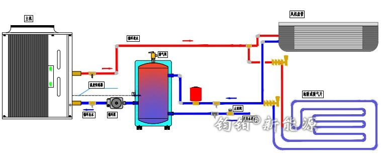
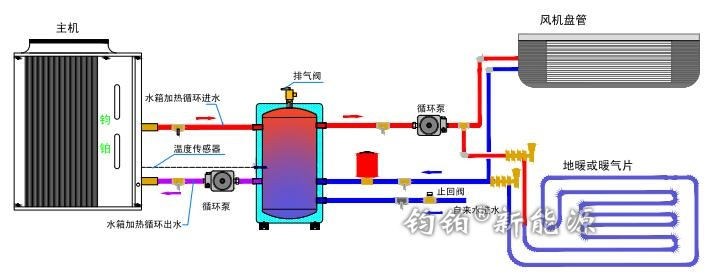

# 3.1 缓冲水箱

缓冲水箱已经成为供暖（空调）系统中的标配，在暖通行业中，常用容积有60L-500L，由于空间和位置的要求最小容积有的达到30L，最大的达到吨位以上水箱。在煤改电工程中，国家规定最小容积要求不得低于60L。

缓冲水箱分为**一次循环系统（单循环）**和**二次循环系统（双循环）**，为避免压缩机频繁启动、增加系统的热稳定性，应校核系统水容量是否能满足系统热稳定性的要求。即当系统中（水）所存储的能量不足以维持短暂停机（比如化霜）时水温波动要求（夏季不大于5℃，冬季不大于3℃），应设置缓冲水箱。关于设置缓冲水箱的优点详见 [6.3 为什么要设置缓冲水箱](../6.-tuo-zhan-yue-du/6.3-wei-shen-me-yao-she-zhi-huan-chong-shui-xiang.md)。

### 一、单循环缓冲水箱的安装

热水从主机接口接到终端风机盘管/地暖/暖气片等，这些终端可以是并联或通过分水器控制。水温降低后回到水箱储存，此时的热水尚有余热。经过循环泵强制循环到主机内继续加热，如果水温尚可供应终端，此时主机并不会启动，这样就能起到节能和保护主机的作用。

> 注意：如果主机已经内置循环泵，上图中的循环泵不需要重复安装。

### 二、双循环缓冲水箱的安装

从上图可以看出，双循环系统是以水箱为主体，左侧是主机循环加热水箱内热水；右侧是水箱循环给终端；当水箱内热水下降到设定温度时，左侧的热源循环会再次循环加热。

> 注意：如果主机已经内置循环泵，上图中的左侧位置的循环泵不需要重复安装。

### 三、单循环和双循环水箱的区别

综合以上可以看出来，双循环水箱比单循环水箱仅仅是多了2只循环接口。但在系统安装中，需要多安装一只循环泵，系统才能正常工作。

从安装成本考虑，双循环系统比单循环系统会高一些，但是性能上双循环系统更优。综合考虑成本和性能，一般建议水箱小于300L使用单循环，大于300L使用双循环。

