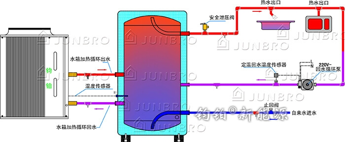

# 3.2 热水水箱

储能热水水箱储存来自空气能/热泵主机、太阳能、锅炉、壁挂炉等热水，是热源系统和生活热水系统的交接点，解决一次性主机到生活热水循环扬程过大问题，同时当用户端用水量较少时，储存多余的热水待下次使用。储能热水水箱是集合多种能源，满足在一种热源不能加热时，可以采用其他辅助加热系统，使水箱实现全年全天侯使用，即时即用。

**图纸分析：**

A. 左侧是主机与水箱循环，主机在运行过程中，通过循环热对流加热提升水箱内热水温度，当水箱内的热水温度达到设定温度时，通过 T1 温度传感器传递信号给主机，此时主机停止工作。 

B. 右侧上方的热水出口，连接生活热水使用终端（水龙头）；终端与水箱间的循环为可选安装系统，主要作用是即开水龙头即得热水，否则需要等待放完管道内的冷水才能得到热水。 

C. 右侧下方的自来水进水，是与热水终端同步的，用掉 N升 热水，这里同时补进 N升 冷水，所以在自来水停水状态下，无法使用水箱内的热水。

D. 在上图的水箱上再开2个孔给供暖循环使用也是可行的，但是会带来一个问题：供暖循环在夏季并未启动，到了采暖季，供暖管道内的死水将激活，严重影响生活热水的用水质量。

