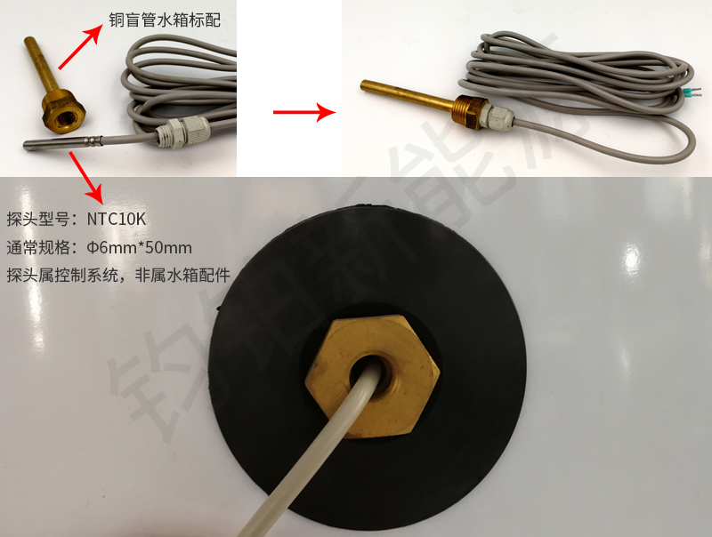

# 3.5 系统安装中的配件

**球阀：**管道中的截流开关，应当在每一个支路中安装，便于系统日后维护。

**安全阀：**也叫安全泄压阀，安全阀常用有3公斤-8公斤不等，视系统设定压力选购，起到保护系统的作用。一个系统中至少需要配置2只，起到双保险的作用。

**排污阀：**水箱上安装排污阀，定期排污，可以有效清除杂质污垢。

**温度压力表：**一表两显，可以显示水箱的温度和压力。

**温度表：**仅显示温度的仪表。

**压力表：**仅显示压力的仪表。

**单向阀：**也叫止回阀，建议在进水、出水和相应管道内都要安装，规划水流方向。可以避免在停水时造成系统和水箱产生负压，造成主机、管道和水箱不可逆的损坏。

**膨胀压力罐：**膨胀压力罐内置皮囊，可以伸缩回收整个系统的压力，将整个系统的压力波动降低，是系统安装中不可缺少的部件。

**循环泵：**由于承压保温水箱是使用在封闭系统中，没有循环泵就无法实现强制循环。

**稳压阀：**也叫减压阀，当自来水压力过大时，一般指超过6公斤，需要使用稳压阀接在自来水进口处，将系统整个压力控制在指定范围内。

**负压阀：**负压阀只可进气，不会出水。当系统出现负压时，负压阀导入空气，抵消负压的出现。

**测温盲管：**当控制器的测温探头需要检测管道或水箱内的温度时，将探头塞入测温盲管即可。盲管的尾部是密封的，通过螺纹接口拧在水箱或管道上，安装简单，不使用也无需额外维护。

**测温探头：**控制器上配置的用来探测温度，需要配合测温盲管使用。

电辅助：水箱上配置的电加热辅助，在热源供应不足或空气源热泵化霜时，可以起到辅助的作用。一般在壁挂炉供应生活热水时，电辅助并不建议。

**过滤器：**前置过滤器可以有效过滤杂质颗粒，保证系统运行安全。

补芯：当水箱上的管接头螺纹接口大于管道时，需要使用补芯将接口变径（变小），从而使其与管道匹配。

**堵头：**当水箱上的管接头不使用时，使用堵头密封。材质有塑料、不锈钢、304不锈钢和铜等。

**排气阀：**缓冲水箱中，顶部需要配置排气阀，能够有效排除系统运行时产生的空气。

**镁棒：**当水箱内水温设置过高（不建议过高）和使用电辅助时，水箱应当安装镁棒。镁棒的作用是可以镁离子优先与氯离子反应，从而保护不锈钢（铁离子）内胆。

**流量开关：**显示管道流量的仪表。

