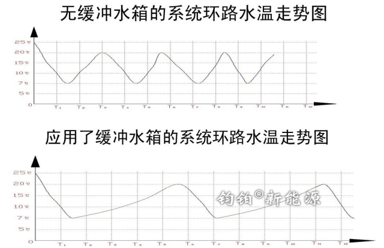

# 6.3 为什么要设置缓冲水箱？

### 一、延长主机寿命

如果不设置缓冲水箱，将导致主机频繁启停（尤其是是定频机组）。特别是当末端系统为暖气片或风机盘管时，环路中的循环水量有限，就会引起主机在很短的时间内达到设计温度，主机就会停止工作，然后又会在很短暂的时间内，水温达到主机启动的条件，这样频繁启停会大大减少主机的使用寿命和浪费能源。加上缓冲水箱就相当于系统能量增加了，系统的温度变化平稳了，主机启动次数也自然减少了，使用寿命也就大大延长了。

### 二、高效除霜

设置缓冲水箱可以高效除霜，除霜时间缩短。机组在除霜反向制冷时需要消耗管道内的热量，如果水系统的水量少，除霜时间就会加长，而且会造成管道内水温较低，除霜效果不好。如果加装了缓冲水箱，那么在除霜的过程中，因为水箱内有一定的温度，可以在短时间内完成化霜，并且消耗热量也比较小，避免了因为主机除霜而造成的室内温度波动变化。

### 三、自动排气

缓冲水箱的第三个好处是能够保证系统的水流畅通，能够完成自动排气，避免机组循环不畅报故障停机。

### 四、彻底排污

设置缓冲水箱可以让系统排污更彻底，防止系统阻塞。系统中的杂质会通过循环慢慢沉积到缓冲水箱的底部，经过过滤器的时候，水泵的水质会变好，从而减少过滤器的清洗。

